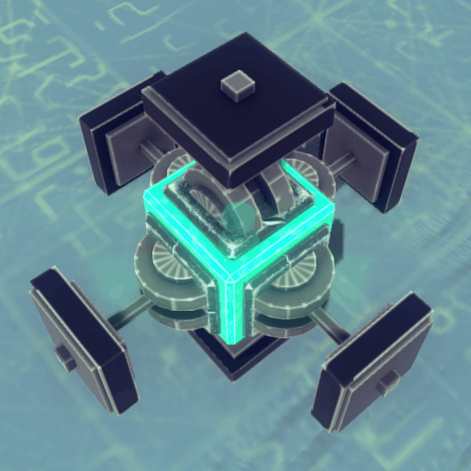
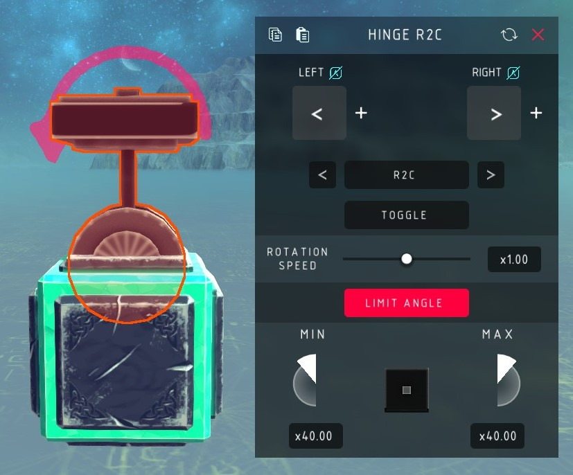

# Besiege Return 2 Center

A steering hinge and a steering block that spring back to centre, in
[Besiege](https://store.steampowered.com/app/346010/Besiege/).



The stock steering blocks stay where you left them. These come back to neutral
the moment you let go of the key — which is what you want for a car, a plane, or
anything you have to drive rather than aim.

They are the built-in hinge and steering block otherwise: same meshes, same
limits, same rotation speed and tension sliders, and they snap onto the same
grid.

## Install

Either subscribe to the mod on Steam, or if you don't use Steam you can clone the
repo then:

```sh
./tools/install.sh              # symlink into Besiege_Data/Mods
./tools/install.sh --copy       # copy instead
./tools/install.sh --uninstall
```

Set `BESIEGE_DIR` if your install isn't found automatically. Start Besiege, enable
**Return 2 Center** in the mods menu, and the two blocks show up in the block
menu — search `R2C`. No C# toolchain is needed; the build uses Besiege's own
compiler.

## The blocks

Two of them, a hinge and a block, matching the shape of the base-game pair.



## Settings

| Setting | What it does |
| --- | --- |
| Left / Right | The two steering keys. Default `←` and `→` |
| Rotation Speed | How fast it turns |
| Tension | How hard it holds its angle, `0.5x` to `2x`. Same slider, same curve, as the built-in blocks — it bites hard, `0.5x` is a sixty-fourth of the stiffness and `2x` is sixty-four times it |
| Toggle | Off: hold the key to steer. On: press once to start, press again to stop |
| Limits | How far it turns each way, same as the stock steering blocks |
| Mode | `R2C`, `S2S` or `Normal` — below |

**R2C** is the point of the mod: steer while the key is down, and let go and it
winds back to centre at the same speed. With **Toggle** on, it holds the angle
until you press again, and reaching a limit stops it by itself.

**S2S** sweeps side to side between the two limits, reversing at each end. Press
once to set it going.

**Normal** is the stock behaviour — the angle stays where you leave it.

## Building

`Mod.xml` loads a prebuilt assembly, and one is checked in, so a clone is ready to
install as-is. To change the code:

```sh
./tools/verify-build.sh    # compile check, leaves the shipped assembly alone
./tools/build.sh           # compile and install into Return2Center/
```

The source is one file, [`Return2Center/R2CScripts/Mod.cs`](Return2Center/R2CScripts/Mod.cs).
It was recovered from the 2018 assembly, which is a story of its own —
[docs/RECOVERY.md](docs/RECOVERY.md). If you are changing anything, read
[AGENTS.md](AGENTS.md) first: several names in here are load-bearing for saved
machines and cannot be renamed.
